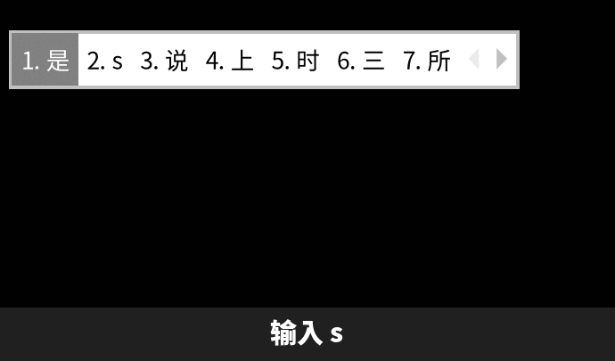

# fcitx5-multiselector

[](LICENSE) [](https://github.com/GeojoL/fcitx5-multiselector/releases)

**fcitx5 候选词展开插件**：候选只有一行时，按 **← →** 就能选词；按 **↓** 把它展开成 **4 行 × 8 列**，用方向键挑选，用法和搜狗、微信输入法一样。



> 这是 fcitx5 的一个**插件**，不是新的输入法。装上后你的拼音照常使用，只是多了「↓ 展开」这一个功能。
> 动图是 fcitx5 默认主题在虚拟显示里实际渲染的画面（拼音关闭了符号/emoji 候选）。

[安装](#安装) · [按键](#按键) · [常见问题](#常见问题) · [更新日志](CHANGELOG.md) · [English](#english)

## 为什么做这个

在 Windows、macOS 上，搜狗和微信输入法按 ↓ 就能展开候选，一眼看到二三十个词。换到 Linux 的 fcitx5 后，候选框只有一行（拼音默认每页 7 个）。要找的字不在第一页时，只能按 `=` 一页一页往后翻。

fcitx5 自带的候选框只支持横排和竖排，没有多行网格，所以做了这个插件。它独立于输入法运行，不需要改任何设置。

## 安装

这是一个插件，**不是**打包好的输入法，要按顺序装。下面的步骤都实际测试过（测试方法见[适用范围](#适用范围)）。

**第 1 步：先装好 fcitx5 和中文输入法，并确认能正常打中文。**
插件只是给已有的输入法加上「↓ 展开」功能，本身不带输入法。如果 fcitx5 已经在用，跳过这一步。

```bash
# Fedora 44
sudo dnf install fcitx5 fcitx5-chinese-addons
# Debian 13
sudo apt install fcitx5 fcitx5-chinese-addons
```

**第 2 步：装编译工具**（插件需要从源码编译，目前没有安装包）

```bash
# Fedora 44
sudo dnf install fcitx5-devel cmake gcc-c++
# Debian 13
sudo apt install libfcitx5core-dev cmake g++
```

**第 3 步：编译并安装插件**

```bash
git clone https://github.com/GeojoL/fcitx5-multiselector.git
cd fcitx5-multiselector
./install.sh
```

**第 4 步：重新启动 fcitx5**，插件就生效了。打几个拼音，按 ↓ 试试。KDE Wayland 下的重启方法见[常见问题](#常见问题)。

卸载：运行 `./uninstall.sh`，再重新启动 fcitx5。

插件只往用户目录装两个文件：`~/.local/lib/fcitx5/multiselector.so` 和 `~/.local/share/fcitx5/addon/multiselector.conf`。安装时不需要 sudo，也不改系统文件。

### Bazzite / Fedora Atomic（不可变系统）

本机不能直接装编译工具时，可以在 toolbox 里编译。`install.sh` 发现本机没有 cmake，会自动使用名为 `fcitx5-build` 的 toolbox：

```bash
toolbox create fcitx5-build
toolbox run -c fcitx5-build sudo dnf install -y fcitx5-devel cmake gcc-c++
./install.sh
```

## 按键

一行候选时：

| 按键 | 作用 |
|---|---|
| ← → | 选词（高亮跟着移动，到本页末尾自动翻页，到第一个或最后一个就停） |
| 空格 | 上屏高亮的词 |
| ↓ | 展开成网格，从高亮的词开始 |

展开后：

| 按键 | 作用 |
|---|---|
| ↑ ↓ ← → | 移动 |
| 空格 / 回车 | 上屏选中的词 |
| 1–8 | 上屏当前行第 N 个 |
| PgDn / `=` / `]`，PgUp / `-` / `[` | 翻页（顶部显示页码，如 `1/13`） |
| Esc，或在第一行按 ↑ | 收起 |
| 其他键 | 自动收起，可以接着打字 |

## 适用范围

| 环境 | 状态 | 怎么测的 |
|---|---|---|
| Bazzite（Fedora 44）+ KDE Plasma Wayland + fcitx5 5.1.22 拼音 | ✅ | 作者日常使用；安装用的是上面的 toolbox 方法 |
| Fedora 44（fcitx5 5.1.23）| ✅ | 在干净的容器里按本文第 1–4 步安装，用虚拟 X11 显示逐步截图核对：展开、移动、翻页、收起、选词上屏、卸载 |
| Debian 13（fcitx5 5.1.12）| ✅ | 同上 |
| Ubuntu 24.04（fcitx5 5.1.7）及更低版本 | ❌ | 编译失败，不支持 |
| 其他发行版、GNOME / Sway 等其他桌面 | 未测试 | |
| Rime 等其他 fcitx5 输入法 | 未测试 | |
| kimpanel 等非经典界面（classicui）的候选框 | 未测试 | |

v0.0.3 新增的一行 ← → 选词：在 Fedora 44（fcitx5 5.1.23）的隔离虚拟显示里逐项核对过（选词、跨页、两端停住、空格上屏、接着按 ↓ 展开）；Debian 13 只验证了能编译，其他环境未测试。

欢迎在 Issue 里反馈你的测试结果。

## 常见问题

**装了按 ↓ 没反应？**
先确认 fcitx5 已经重启过，再看日志里有没有 `Loaded addon multiselector`。比如 KDE 下 fcitx5 由 KWin 启动，可以运行 `journalctl --user -b | grep multiselector`。

**能改成 4×7 或别的大小吗？**
目前固定为 4×8，暂时不能调整。

**和把候选框设成竖排有什么区别？**
竖排只是把一行变成一列，每页的数量不变。网格一屏能看到 32 个候选，可以上下左右跳着选。

**会影响词频、词库吗？**
不会。上屏用的还是输入法自己的候选，用户词频照常学习（已验证）。

**KDE Wayland 下怎么手动重启 fcitx5？**
fcitx5 由 KWin 启动。作者实测：kill 掉后 KWin 不会自动拉起；通过 DBus 重启也不生效（`fcitx5 -r` 没测过）。以下办法实测可行：
```bash
pkill -x fcitx5
kwriteconfig6 --notify --file kwinrc --group Wayland --key InputMethod ""
kwriteconfig6 --notify --file kwinrc --group Wayland --key InputMethod /usr/share/applications/org.fcitx.Fcitx5.desktop
```

## 已知限制

- 网格收起后，拼音的 Tab 笔画筛选暂时不生效，接着打字就恢复。
- 列宽按字符宽度估算（汉字算 2，英文字母算 1）。英文候选较多时，列与列之间可能有几个像素的偏差。
- 网格大小固定为 4×8。
- 有候选时 ← → 用来选词，不能再用它们在拼音里移动光标（比如把 `shi` 改成 `shai`）。要改拼音，可以用退格删掉重打。
- fcitx5 升级大版本后需要重新运行 `./install.sh`。

## 原理（给开发者）

插件在输入法之前拦截按键。展开时保存输入法原来的候选列表，界面上换成网格（每行是一个候选项，选中的词用高亮格式标出）。上屏时调用原列表里的候选，收起时用代理对象把原列表放回去。只要输入法提供完整的候选列表（BulkCandidateList），插件就能工作。

## 相关项目

- [fcitx5-cloudsecond](https://github.com/GeojoL/fcitx5-cloudsecond)：让前两个候选都来自百度云（fcitx5 自带云拼音只取第一个），百度能纠正打错的拼音。可以和本插件同时使用（已实测）。

## 许可证

LGPL-2.1-or-later，与 fcitx5 一致。

## English

**fcitx5-multiselector** is a fcitx5 addon (not a new input method) that
brings Sogou / WeType-style candidate selection to Linux. While the usual
one-line candidate list is shown, **Left / Right** move the highlight (Space
commits it; the cursor pages forward and stops at either end), and **Down**
expands it into a **4×8 grid**: move with the arrow keys, commit with
Space / Enter / 1–8, page with PgUp / PgDn (also - = [ ]), and collapse with
Esc (or just keep typing). While candidates are shown, Left / Right no longer
move the cursor inside the typed pinyin.

Why: fcitx5's classic UI only offers a horizontal or vertical candidate list,
so picking a word that is not on the first page means paging blindly. Sogou and
WeType let you see 30+ candidates at once; this addon does the same on fcitx5.

It is a pure view over the input method's own candidate list, so engine
behaviour (e.g. user history) is unchanged and no system files
or IME settings are modified. Requires fcitx5 ≥ 5.1.12. Build and install with
`./install.sh`; remove with `./uninstall.sh`. Used daily on KDE Plasma Wayland
with fcitx5 Pinyin (Bazzite / Fedora 44); the install steps were tested end to
end in clean Fedora 44 and Debian 13 containers. Other setups are untested.
